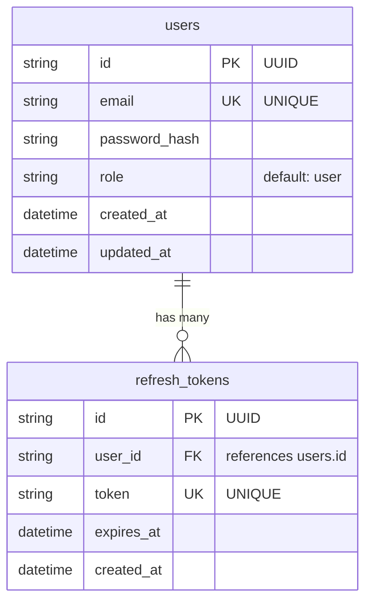

# データベースER図

## Mermaid記法によるER図

## テーブル詳細

### users テーブル

| カラム名      | 型            | 制約                     | 説明                         |
| ------------- | ------------- | ------------------------ | ---------------------------- |
| id            | String (UUID) | PRIMARY KEY              | ユーザーの一意識別子         |
| email         | String        | UNIQUE, NOT NULL         | メールアドレス（ログインID） |
| password_hash | String        | NOT NULL                 | ハッシュ化されたパスワード   |
| role          | String        | NOT NULL, DEFAULT "user" | ユーザーの権限               |
| created_at    | DateTime      | NOT NULL, DEFAULT now()  | アカウント作成日時           |
| updated_at    | DateTime      | NOT NULL, AUTO UPDATE    | 最終更新日時                 |

### refresh_tokens テーブル

| カラム名   | 型            | 制約                    | 説明                         |
| ---------- | ------------- | ----------------------- | ---------------------------- |
| id         | String (UUID) | PRIMARY KEY             | トークンレコードの一意識別子 |
| user_id    | String (UUID) | FOREIGN KEY, NOT NULL   | ユーザーID（users.idを参照） |
| token      | String        | UNIQUE, NOT NULL        | リフレッシュトークンの値     |
| expires_at | DateTime      | NOT NULL                | トークンの有効期限           |
| created_at | DateTime      | NOT NULL, DEFAULT now() | トークン作成日時             |

## リレーションシップ

- **users → refresh_tokens**: 1対多（One-to-Many）
  - 1人のユーザーは複数のリフレッシュトークンを持つことができる
  - 削除動作: CASCADE DELETE（ユーザーを削除すると、関連するリフレッシュトークンも自動削除）

## インデックス

- **refresh_tokens.user_id**: ユーザーIDでの検索を高速化
- **refresh_tokens.token**: トークン値での検索を高速化（ユニーク制約も含む）

## データベース情報

- **データベースタイプ**: SQLite
- **スキーマファイル**: `server/prisma/schema.prisma`
- **マイグレーション**: `server/prisma/migrations/`
